

<!--
  Every image below is a self-contained animated SVG. GitHub strips <script>
  from a README and from an SVG loaded through , but it DOES run SMIL and
  CSS keyframe animations inside one — so all the motion lives in the files and
  the README only places them.

  The account buttons are separate images wrapped in <a href> because links
  INSIDE an -embedded SVG never fire; the anchor has to be in the markdown.

  Rebuild:  python3 scripts/render_all.py
  Grammar:  DESIGN.md      Contract: docs/03-pages/profile.md
-->











<a href="https://github.com/CameronMc12"></a>
<a href="https://krevio.co.za"></a>
<a href="https://linkedin.com/in/cameronmcallister"></a>
<a href="https://x.com/cameronmcal"></a>
<a href="https://instagram.com/cameronmcal"></a>

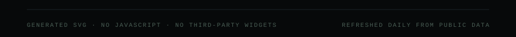

