<!--
  Everything below is a self-contained animated SVG. GitHub strips <script> and
  almost all inline CSS from a README but does render SVGs embedded via 
  and does run their SMIL / CSS-keyframe animations, so all the motion lives
  inside the files.

  <picture> + prefers-color-scheme is how this follows the reader's theme; the
  dark and light pairs are generated together by the same scripts.

  Rebuild:  python3 scripts/render_all.py
  Contract: docs/03-pages/profile.md   Grammar: DESIGN.md
-->

<picture>
  <source media="(prefers-color-scheme: dark)" srcset="./assets/hero-dark.svg">
  
</picture>

 
 

<picture>
  <source media="(prefers-color-scheme: dark)" srcset="./assets/wordmark-dark.svg">
  
</picture>

 
 

<picture>
  <source media="(prefers-color-scheme: dark)" srcset="./assets/heatmap-dark.svg">
  
</picture>

 
 

 

